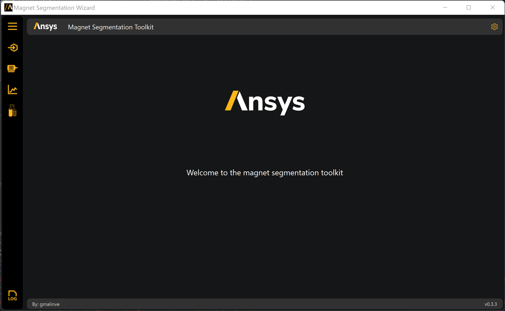
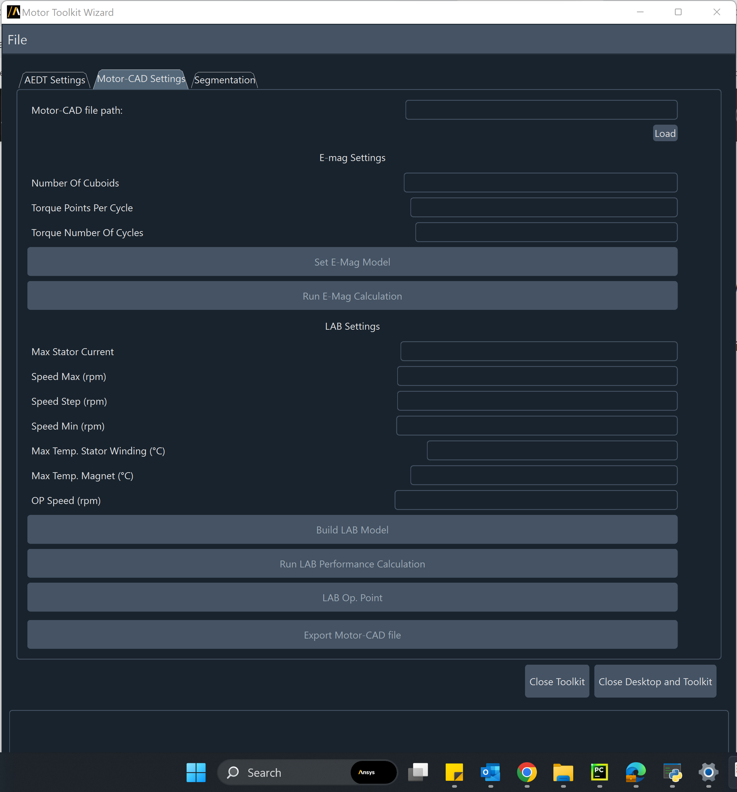
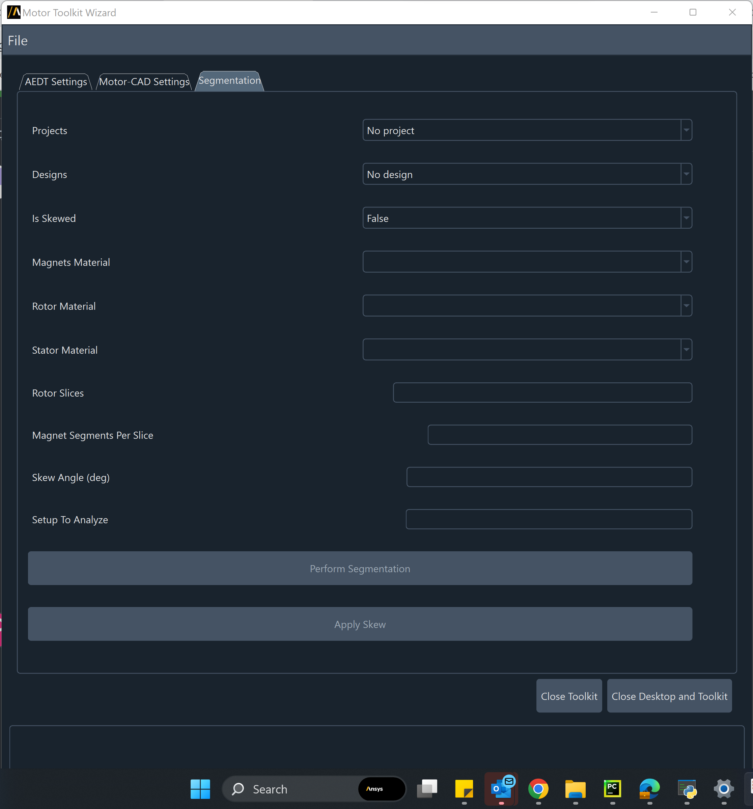

============
UI reference
============

This section describes user interface available in AEDT's **Motor Toolkit**.
To run the **Motor Toolkit**, you must have a licensed copy of Ansys Electronics
Desktop (AEDT) installed and a Motor-CAD one.

Once **Motor Toolkit** is launched, user can choose to provide as input a 3D motor model in AEDT or a Motor-CAD file.
In the first case the user can load an .aedt file by clicking on **Select aedt project** and then **Launch AEDT** from
the first tab **AEDT Settings**.

In the second case the user can specify the AEDT settings from first page and connect the toolkit to an existing AEDT
session or create a new one, this is necessary when exporting the 3D motor model from Motor-CAD.
Then in the **Motor-CAD Settings** tab load the .mot file by clicking on **Load**.

After one of the two inputs has been provided, the user has to switch to the **Segmentation** tab to set the project and
the design to work with as well as the segmentation settings.

The user can save the project, File>Save project.

The wizard has a progress bar and a logger box, where the user can see the status of every operation.
Red progress bar means the toolkit is busy, and every operation need to wait until the toolkit is released.
